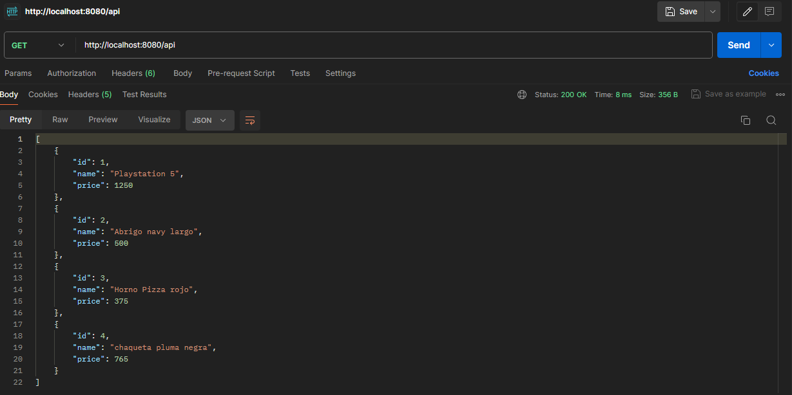
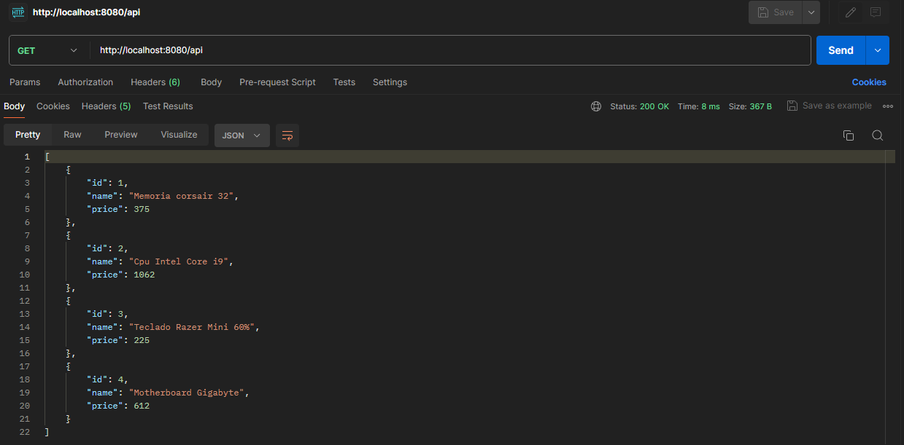
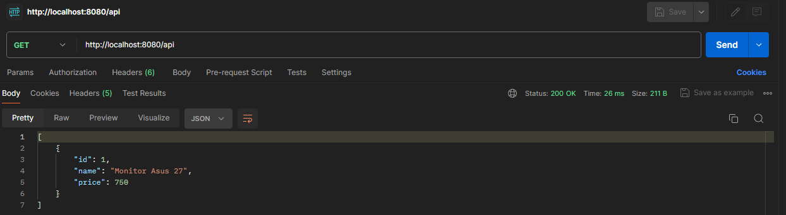

# Utilizando Spring MVC - Inyeccion de Dependencias
## Descripción del proyecto

Este proyecto es una aplicación web básica construida con Spring MVC e Inyeccion de Dependencias(ioC). 

Inyectamos los componentes mediante interfaces al controlador.

## Características

- **Spring MVC**: Para la gestión de solicitudes y la lógica del controlador.
- **DTOs**: Para el transporte de datos de manera estructurada y segura.
- **Inyeccion de Dependencias**: Permite a una clase, obtener desde el contenedor, una referencia de otro objeto.
- **Maven**: Para la gestión de dependencias.
- **Spring Boot**: Para facilitar la configuración y el despliegue de la aplicación.
- **Postman**: Facilita las peticiones HTTP, para crear APIs.


## Recursos
El proyecto esta creado con las siguientes tecnologías, las primeras 3 se obtienen
al momento de crear el proyecto.


| Plugin                |
|-----------------------|
| Spring Web            | 
| Spring Boot DevTools  | 
| Spring Boot Actuator  | 


## Estructura del proyecto

```
src/main/java/com/franco/springboot/di/app/springboot
    ├── SpringbootDiApplication.java
    ├── AppConfig.java
    ├── controllers/
    │   └── SomeController.java
    ├── models/
    │   └── Product.java
    ├── services/
    │   └── ProductService.java
    │   └── ProductServiceImpl.java
    └── repositories/
        └── ProductRepository.java
        └── ProductRepositoryFoo.java
        └── ProductRepositoryImpl.java
        └── ProductRepositoryJson.java
        
```

## Uso de la Inyeccion de Dependencias

Primero se inyecta `ProductRepository` a `ProductService `, luego `ProductService ` a `SomeController`

```
@RestController
@RequestMapping("/api")
public class SomeController {
    
    @Autowired
    private ProductService service;

    @GetMapping
    public List<Product> list() {
        return service.findAll();
    }
    
    @GetMapping("/{id}")
    public Product show(@PathVariable Long id) {
        return service.findById(id);
    }
}
```

## Uso de Postman

**URL**
```sh
http://localhost:8080/api
```

* Desde el `ProductserviceIml` manejamos los datos que vienen de `ProductRepositoryJson`.

    Mediante `@Qualifier` seleccionamos la clase `ProductRepositoryJson` sobre las demas.

```
@Service
public class ProductServiceImpl implements ProductService {

    @Value("${config.price.tax}")
    private Double tax;

    private ProductRepository repository;

    public ProductServiceImpl(@Qualifier("productJson") ProductRepository repository) {
        this.repository = repository;
    }

    @Override
    public List<Product> findAll() {
        return repository.findAll().stream().map(p -> {
            Double priceTax = p.getPrice() * tax;
            Product newProd = (Product) p.clone();
            newProd.setPrice(priceTax.longValue());
            return newProd;
        }).collect(Collectors.toList());
    }

    @Override
    public Product findById(Long id) {
        return repository.findById(id);
    }
}


```


* Eliminamos el `@Qualifier` del contructor de `ProductserviceIml` para que asi pueda tomar `ProductRepositoryImpl`,
 este tiene como componente a `@Primary`.

```
@Primary
@Repository("productList")
public class ProductRepositoryImpl implements ProductRepository {
    
    private List<Product> data;

    public ProductRepositoryImpl() {
        this.data = Arrays.asList(
                new Product(1L, "Memoria corsair 32", 300L),
                new Product(2L, "Cpu Intel Core i9", 850L),
                new Product(3L, "Teclado Razer Mini 60%", 180L),
                new Product(4L, "Motherboard Gigabyte", 490L));
    }

    @Override
    public List<Product> findAll() {
        return data;
    }

    @Override
    public Product findById(Long id) {
        return data.stream().filter(p -> p.getId().equals(id)).findFirst().orElse(null);
    }
  
}

```



* Cambiamos el parametro de `@Qualifier` a `@Qualifier("productFoo")`, para que pueda tomar `ProductRepositoryFoo`.
```
@Service
public class ProductServiceImpl implements ProductService {

    @Value("${config.price.tax}")
    private Double tax;

    private ProductRepository repository;

    public ProductServiceImpl(@Qualifier("productFoo") ProductRepository repository) {
        this.repository = repository;
    }

    @Override
    public List<Product> findAll() {
        return repository.findAll().stream().map(p -> {
            Double priceTax = p.getPrice() * tax;
            Product newProd = (Product) p.clone();
            newProd.setPrice(priceTax.longValue());
            return newProd;
        }).collect(Collectors.toList());
    }

    @Override
    public Product findById(Long id) {
        return repository.findById(id);
    }
}
```
```
@Repository("productFoo")
public class ProductRepositoryFoo implements ProductRepository {

    @Override
    public List<Product> findAll() {
        return Collections.singletonList(new Product(1L, "Monitor Asus 27", 600L));
    }

    @Override
    public Product findById(Long id) {
        return new Product(id, "Monitor Asus 27", 600L);
    }
    
}
```


